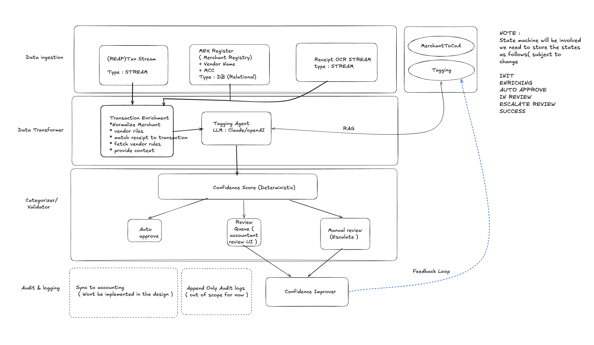
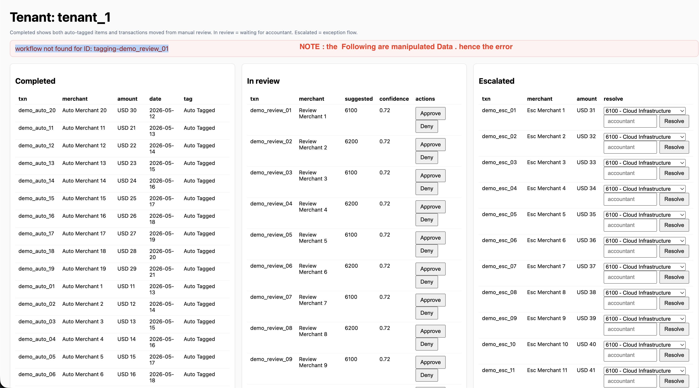
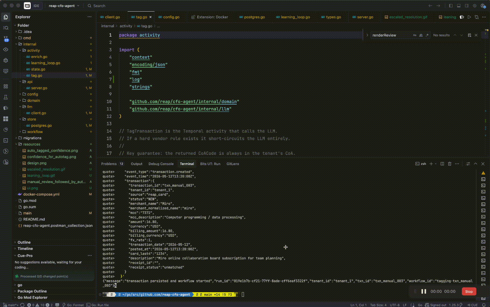
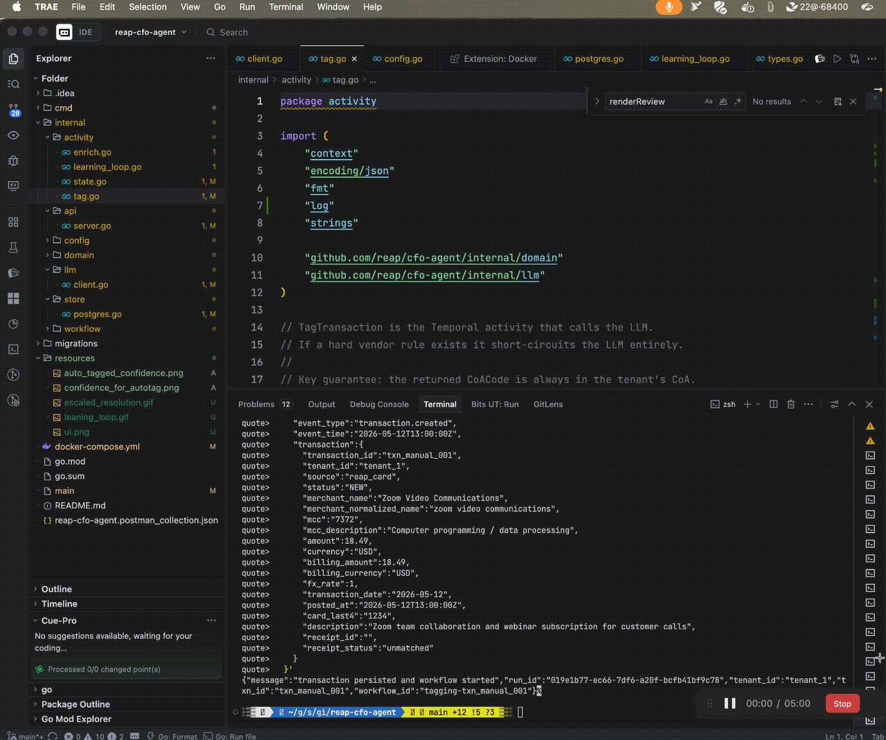
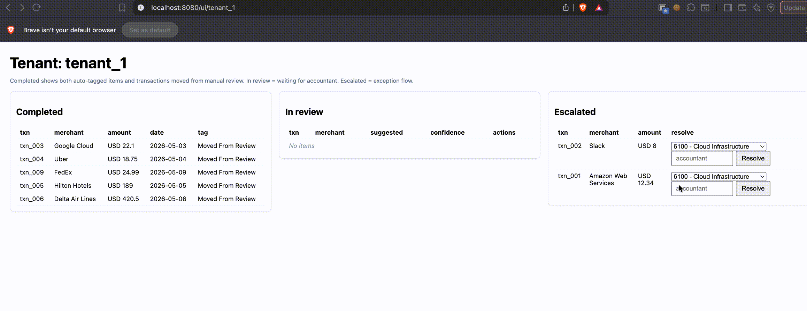
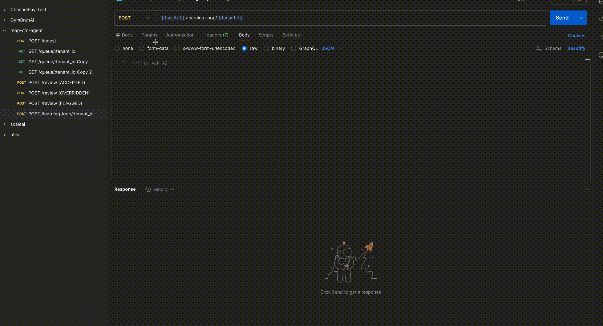
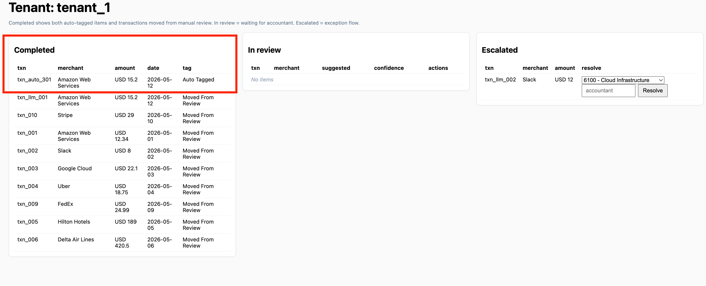
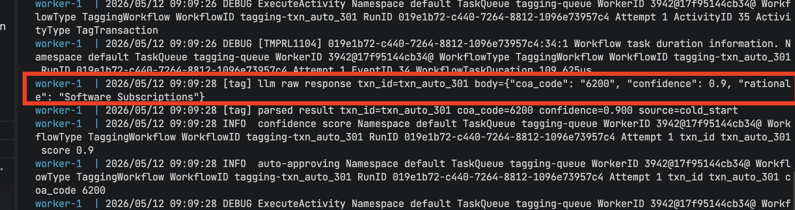

# Reap CFO Agent — Transaction Auto-Tagging

Go implementation of Workflow 1 from the Reap CFO Agent take-home.

## Product walkthrough

System design:



Current UI:



Typical flows:

- Manual review denied to escalated queue:



- Manual review resolved and later reflected in completed flow:



- Escalated resolution flow:



- Learning loop refresh:



Confidence examples:
The below examples shows that the system moves to auto approve when the confidence is high enough ( set by the user per tenant).




## Architecture decisions

### Why Temporal

The design requires a durable state machine with long-running waits, retries, and human-in-the-loop decisions. Temporal is a better fit than implementing that behavior directly in Postgres.

- **Durable workflow execution**: state transitions are persisted by Temporal. If a worker crashes during enrichment or tagging, the workflow resumes from the last durable checkpoint instead of rebuilding state from DB locks or cron recovery logic.
- **Native human-in-the-loop waits**: `IN_REVIEW` and `ESCALATED` both rely on workflow signals. The workflow can pause safely and resume when the accountant acts, without polling or timeout bookkeeping outside the workflow engine.
- **Built-in retry model**: activity retries are explicit and typed. Network failures, temporary model issues, and strict-prompt retries stay inside workflow orchestration rather than being scattered across handlers or DB jobs.
- **Operational visibility**: Temporal UI provides execution history, retry visibility, and workflow progression without building a custom state-machine debugger.

### Workflow states

The workflow follows the state model from the HLD:

```
INIT → ENRICHING → TAGGING → AUTO_APPROVE | IN_REVIEW | ESCALATED → SUCCESS
```

- `INIT`: event accepted and transaction persisted
- `ENRICHING`: fetch CoA, vendor rules, receipt context, and RAG neighbours
- `TAGGING`: LLM or hard rule proposes the CoA mapping
- `AUTO_APPROVE`: high-confidence deterministic route
- `IN_REVIEW`: accountant review required
- `ESCALATED`: low-confidence or exception path requiring explicit resolution
- `SUCCESS`: final resolved state after approval, override, or escalated resolution

### Local model strategy

For local and test runs, the LLM provider is configured through the `factory pattern` and defaults to a local OpenAI-compatible model endpoint (`llm:8080` inside Docker network / mapped host port). This allows end-to-end testing without relying on hosted APIs while preserving the same call contract used by the tagging activity.

Code path:
- provider selection: [client.go](file:///Users/bytedance/go/src/github.com/reap-cfo-agent/internal/llm/client.go)
- prompt + parse loop: [tag.go](file:///Users/bytedance/go/src/github.com/reap-cfo-agent/internal/activity/tag.go)
- local model wiring: [docker-compose.yml](file:///Users/bytedance/go/src/github.com/reap-cfo-agent/docker-compose.yml)

### RAG pipeline

RAG is used as retrieval context for tagging, not as a final decision-maker. `PostgreSQL` is the primary application store, and `pgvector` in `PostgreSQL` is used to store and retrieve historical examples from `txn_vectors`. The workflow enriches each transaction with nearest historical examples scoped by tenant, then injects that context into the tagging prompt.

- retrieval query is vector similarity search in `pgvector`
- retrieval is tenant-scoped (`tenant_id` isolation)
- learning loop writes back confirmed examples into `txn_vectors`

Code path:
- retrieve neighbours during enrichment: [enrich.go](file:///Users/bytedance/go/src/github.com/reap-cfo-agent/internal/activity/enrich.go)
- embedding + vector query/upsert: [postgres.go](file:///Users/bytedance/go/src/github.com/reap-cfo-agent/internal/store/postgres.go)
- feedback writeback loop: [learning_loop.go](file:///Users/bytedance/go/src/github.com/reap-cfo-agent/internal/activity/learning_loop.go)

### Confidence routing

Routing is deterministic after tagging. The LLM proposes a code and confidence; the router decides the next path.

```
>= auto_approve_min (default 0.90) → AUTO_APPROVE → SUCCESS
>= review_min       (default 0.65) → IN_REVIEW
<  review_min                       → ESCALATED
```

Thresholds are stored in the `confidence_thresholds` table in `PostgreSQL` and support per-tenant overrides with a global fallback. They are runtime configuration, not hardcoded constants.

Code path:
- runtime fetch: [tagging.go](file:///Users/bytedance/go/src/github.com/reap-cfo-agent/internal/workflow/tagging.go)
- threshold lookup and update: [postgres.go](file:///Users/bytedance/go/src/github.com/reap-cfo-agent/internal/store/postgres.go)
- API handler: [server.go](file:///Users/bytedance/go/src/github.com/reap-cfo-agent/internal/api/server.go)

To update the confidence thresholds dynamically at runtime:

```bash
curl -X PUT http://localhost:8080/confidence-thresholds/tenant_1 \
  -H "Content-Type: application/json" \
  -d '{
    "auto_approve_min": 0.95,
    "review_min": 0.60
  }'
```

The next workflow execution for that tenant will pick up the new thresholds automatically.

### Tenant isolation

Tenant isolation is enforced at the data-access layer.

- CoA lookups are scoped by `tenant_id`
- vendor rules are scoped by `tenant_id`
- RAG retrieval is scoped by `tenant_id`
- worklist and review operations are scoped by `tenant_id`

This allows the same merchant to map to different CoA codes for different tenants.

### Hard vendor rules

Repeated accountant overrides can be promoted into deterministic vendor rules.

- once the same vendor is corrected to the same code `VendorRulePromotionCount` times
- `MaybePromoteVendorRule` persists that mapping
- future transactions for that vendor bypass the LLM and return with very high confidence

This reduces repeated manual work and pushes stable patterns out of the model path.

### Error containment

The pipeline is designed to fail safely rather than silently.

- LLM output is validated against the tenant's allowed CoA codes
- invalid or incomplete model output triggers a stricter retry path
- repeated failure does not auto-post; it routes to `IN_REVIEW`
- missing receipt data is surfaced explicitly to the model rather than being silently dropped

## Directory structure

```
cmd/
  worker/main.go     — Temporal worker (registers workflow + activities)
  api/main.go        — Gin HTTP API server
internal/
  domain/types.go    — all types, zero business logic
  workflow/tagging.go — Temporal workflow (state machine + signal wait)
  activity/
    enrich.go        — parallel fetch: receipt, vendor, RAG, CoA
    tag.go           — context assembler + LLM call + output validation
    state.go         — SetTxnStatus, WriteCorrectionEvent, MaybePromoteVendorRule
    learning_loop.go — nightly idempotent RAG refresh
  store/postgres.go  — pgx + pgvector queries
  llm/client.go      — Anthropic SDK wrapper
  api/server.go      — Gin handlers
  config/config.go   — env config
migrations/
  001_initial_schema.sql
```

## Running locally

### Prerequisites
- Docker / Docker Compose
- Go 1.22+ if you want to run binaries outside Compose

### Start the stack

This implementation follows an `ETL`-style processing flow: event ingestion, enrichment/transformation, deterministic routing, and review/resolution. The LLM client is wired using the `factory pattern`, so the design can support different providers such as Anthropic, while the local test setup uses the local model container for end-to-end validation.

1. Start all services:

```bash
docker compose up -d
```

2. Confirm the important endpoints are up:

- API: `http://localhost:8080`
- UI: `http://localhost:8080/ui/tenant_1`
- Temporal UI: `http://localhost:8081`

3. Restart application services after code changes:

```bash
docker compose rm -sf api worker
docker compose up -d api worker
```

4. Tail logs while testing:

```bash
docker compose logs -f api worker
```

The local stack includes:
- `api` on `http://localhost:8080`
- `worker`
- `temporal` and `temporal-ui`
- supporting local services configured in Compose

### Test end-to-end

Create a transaction event via the ingestion API. `/ingest` is the event boundary and should persist the raw transaction before workflow execution.

```bash
curl -X POST http://localhost:8080/ingest \
  -H "Content-Type: application/json" \
  -d '{
    "event_id": "evt_001",
    "event_type": "transaction.created",
    "event_time": "2026-05-11T00:00:00Z",
    "transaction": {
      "transaction_id": "txn_001",
      "tenant_id": "tenant_1",
      "source": "reap_card",
      "status": "NEW",
      "merchant_name": "Amazon Web Services",
      "merchant_normalized_name": "amazon web services",
      "mcc": "7372",
      "mcc_description": "Computer programming / data processing",
      "amount": 12.34,
      "currency": "USD",
      "billing_amount": 12.34,
      "billing_currency": "USD",
      "fx_rate": 1.0,
      "transaction_date": "2026-05-01",
      "posted_at": "2026-05-01T10:00:00Z",
      "card_last4": "1234",
      "description": "AWS monthly subscription",
      "receipt_id": "",
      "receipt_status": "unmatched"
    }
  }'
```

Check the unified worklist API:

```bash
curl http://localhost:8080/worklist/tenant_1
```

Open the built-in UI:

```bash
open http://localhost:8080/ui/tenant_1
```

Trigger the learning loop manually:

```bash
curl -X POST http://localhost:8080/learning-loop/tenant_1
```

## What is NOT implemented (explicitly out of scope)

- Accounting platform sync (Xero/QBO/NetSuite) — noted in HLD as out of scope
- Append-only audit log export — noted in HLD as out of scope  
- Real embedding API call — `embedText()` in store/postgres.go returns a zero vector; replace with OpenAI text-embedding-3-small or equivalent
- Kafka consumer — `POST /ingest` is the stand-in; production wires a Sarama consumer that calls `client.ExecuteWorkflow`
- Receipt OCR pipeline — `FetchReceipt` queries the `receipt_ocr` table; OCR ingestion is a separate service